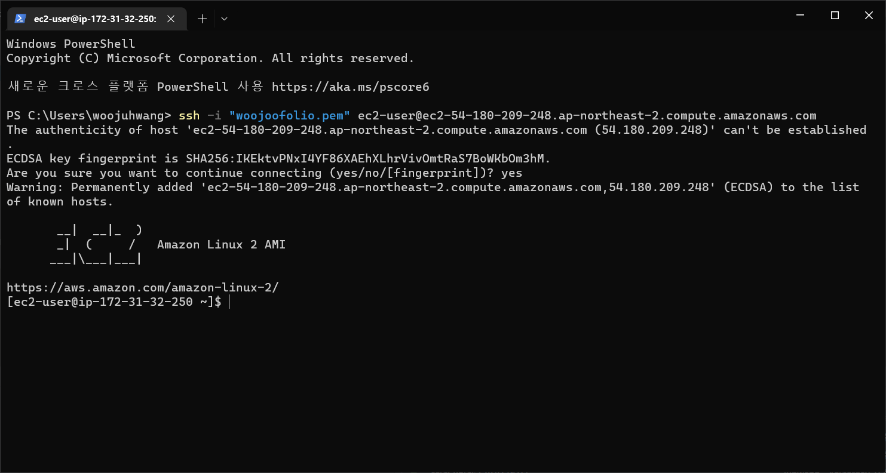

# WOOJOOFOLIO

## SKILLS
 

### SpringBoot
- [X] 그레이들 프로젝트 -> 스프링 부트 프로젝트로 변경
  - build.gradle에서 내용 변경

    buildscript {
        ext {
        springBootVersion = '2.1.7.RELEASE'
        }

        repositories {
        mavenCentral()
        }

        dependencies {
        classpath("org.springframework.boot:spring-boot-gradle-plugin:${springBootVersion}")
        }
    }
    
    apply plugin: 'java'
    apply plugin: 'eclipse'
    apply plugin: 'org.springframework.boot'
    apply plugin: 'io.spring.dependency-management'
    
    
    group 'com.woojoofolio.project'
    version '1.0-SNAPSHOT'
    sourceCompatibility = 11
    
    repositories {
        mavenCentral()
    }
    
    dependencies {
        implementation('org.springframework.boot:spring-boot-starter-web')
        testImplementation('org.springframework.boot:spring-boot-starter-test')
    }

  - [X] springBoot Application 자체 서버 실행
### Git
- [X] 깃허브 원격 저장소 생성
  - 상단 메뉴 Git -> GitHub -> Share Project on GitHub

### Gradle Test
- [X] 테스트 코드 작성
  - UserRepositoryTest
    - [X] User Entity 생성 테스트
    - [X] 생성날짜, 수정날짜 컬럼 자동기입 테스트
  - PostsRepositoryTest
    - [X] Posts Entity 생성 테스트
    - [X] 생성날짜, 수정날짜 컬럼 자동기입 테스트
  - IndexControllerTest
    - [X] 메인 페이지 로딩 테스트
  - PostApiControllerTest
    - [X] Posts CRUD 테스트
### Lombok
- [X] 롬복 설치
  - 플러그인 설치 : ctrl+shift+A -> plugins -> Lombok install -> reboot intelliJ
  - 롬복 의존성 추가

    compileOnly 'org.projectlombok:lombok'
    annotationProcessor 'org.projectlombok:lombok'

### JPA
- [X] Spring Data JPA 설치
  - JPA 의존성 추가

    
    implementation('org.springframework.boot:spring-boot-starter-data-jpa')
    implementation('com.h2database:h2')
- [X] JPA Auditing을 이용하여 생성시간/수정시간 자동화하기
  - domain 패키지에 BaseTimeEntity 생성
  - @MappedSuperclass는 다른 엔티티가 상속한 경우 칼럼으로 인식
  - @EntityListeners(클래스) 해당 클래스의 기능을 빌려옴
  - User, Posts에 BaseTimeEntity 상속
### mustache
- [X] mustache를 이용한 기본 페이지 만들기
  - plugins에서 mustache 검색 후 install
  - 재부팅 후 의존성 추가
  - IndexController 생성 후 이름 리턴

    implementation 'org.springframework.boot:spring-boot-starter-mustache'
- [X] 게시글 등록 화면 만들기
  - PostsApiController(REST) 생성 후 /api/v1/posts 관리
  - PostsRequestDto 생성 후 Posts Entity로 바꾸는 메서드 만들기
  - index.js의 ajax 를 통해 form 안의 정보들을 PostRequestDto로 변환
- [X] 전체 조회 화면 만들기
  - PostsRepository에서 @Query를 이용하여 내림차순 조회하는 쿼리문 만들기
  - PostsService에서 리스트에 있는 Posts를 map 하여 PostsListResponseDto로 변환(id,title,author,modifiedDate)
  - 조회용은 @Transactional에 readonly=true 하기
  - IndexController의 Model에 담기
  - index.mustache에서 mustache 문법을 이용하여 PostListResponseDto 정보 보여주기
- [X] 게시글 수정, 삭제 화면 만들기
  - 수정
    - 제목, 내용을 받을 PostsUpdateRequestDto 생성
    - Posts에서 PostsUpdateRequestDto 정보를 update하는 메서드 만들기
    - PostsService 에서 id를 통해 Posts를 찾고 PostsUpdateRequestDto를 주입하는 메서드 생성
    - index.js의 ajax를 통해 id와 제목, 내용 data 전달
  - 삭제
    - 삭제할 id를 통해 PostsRepository에서 삭제
    - index.js의 ajax를 통해 id 전달(@PathVariable)
### Spring Security
- [X] 스프링 시큐리티 설정
  - 의존성 추가

    implementation 'org.springframework.boot:spring-boot-starter-oauth2-client'

### OAuth 2.0
- [X] 구글 로그인 연동
  - OAuthAttributes
    - registrationId를 통해 구글, 네이버 로그인 구분
    - userNameAttributeName을 통해 자격 인증
    - attributes를 통해 유저의 정보 저장
    - toEntity method를 통해 User 정보로 변환
  - SessionUser
    - User Entity와 유사하지만 직렬화를 지원
    - User Entity에서 받은 정보 중 필요한 정보만 session에 저장해주는 역할
  - CustomOAuth2UserService
    - attributes -> User Entity -> SessionUserDto 로 변경해주는 역할
  - SecurityConfig
    - User의 역할에 따라 접근 가능한 URL을 구분
  - application-oauth.properties를 통해 클라이언트 아이디와 비밀번호, scope 정보 입력
- [X] 네이버 로그인 연동
  - 네이버 로그인은 스프링 시큐리티를 지원하지 않기 때문에 application-oauth에 적어야 할 정보가 많음

### AWS
- [X] 깃 클론하기

    sudo yum install git
    git clone [클론할 주소]

#### EC2
- [X] 인스턴스 생성
- [X] 보안그룹 생성
- [X] 탄력적 IP 할당
- [X] EC2 연결
  - 윈도우의 경우 개인 키(.pem) 다운받은 뒤 터미널에서 연결할 경로에 옮기고 EC2 인스턴스에서 연결에 들어가 ssh 연결 명령어를 터미널에 입력한다.
- [X] EC2 Java 11 설치
  - [Java 11 설치 방법] (https://pompitzz.github.io/blog/Java/awsEc2InstallJDK11.html) .
- [X] EC2 HostName 변경

    sudo hostnamectl set-hostname 바꾸고 싶은 이름
    sudo reboot #인스턴스 재부팅 후 적용

#### RDS
- [X] RDS 생성
- [X] 파라미터 그룹 설정
  - character 와 collate 를 각각 utf8mb4, utf8mb4_general_ci 로 변경
  - time_zone 에서 Asia/seoul로 변경
  - db에 파라미터 그룹 연결
- [X] db 보안그룹에서 사용 중인 EC2 보안그룹 ID를 복사하여 Mysql/Aurora에 저장, 내 IP도 저장
- [X] DataBase Navigator 플러그인을 이용하여 리빌드
  - MySQL 추가 후 RDS의 EndPoint를 Host에 입력, 아이디, 비밀번호 입력
  - 테스트 후 생성
  - 새로운 console을 만들고 쿼리문 입력

    use woojoofolio;

    show variables like 'c%';
    
    ALTER DATABASE woojoofolio
    CHARACTER SET = 'utf8mb4'
    COLLATE = 'utf8mb4_general_ci';
    
    select @@time_zone, now();
    
    CREATE TABLE test (
    id bigint(20) NOT NULL AUTO_INCREMENT,
    content varchar(255) DEFAULT NULL,
    PRIMARY KEY (id)
    ) ENGINE=InnoDB;
    
    insert into test (content) values ('테스트');
    
    select * from test;
- [X] EC2에서 RDS 접근 확인
  - EC2에 mysql 다운로드 및 확인

    
    sudo yum install mysql
    mysql -u [계정 ID] -p -h [Host네임]; #RDS 접근
    show databass; # 데이터베이스 목록 확인
#### IAM
- [X] 역할 생성
  - EC2 권한 생성
  - CodeDeploy 권한 생성
- [X] 사용자 생성
  - S3 출입 허가를 위한 권한(AmazonS3FullAccess,AWSCodeDeployFullAccess)을 가지는 AWS_ACCESS_KEY 생성
- [X] EC2에 IAM 역할 추가
#### S3
- [X] 버킷 생성
  - 특이사항 없음
#### CodeDeploy
- [X] 에이전트 설치
- [X] 애플리케이션 생성
- [X] 배포 그룹 생성
### Nginx
- [ ] Nginx 설치
- [ ] Nginx 포트 연결
### Github Action
- [X] PR을 했을 때 자동으로 빌드 및 테스트로 Merge 검사
  - Action -> Java with gradle -> gradle.yml 생성
- [X] 깃 푸시를 했을 때 자동으로 테스트 후 배포하는 deployment.yml 생성
  - S3에 접근하여 빌드할 jar 파일을 zip 파일로 변경 후 버킷에 올리기
  - CodeDeploy를 이용하여 S3에 있는 파일을 EC2에 옮기기

## 과정 정리
### 1단계 - 수동 중단 배포 : ~/app/step1/deploy.sh 실행할 때만 배포
- [X] deploy.sh 배포 스크립트 작성
  - git pull 받기
  - gradle 빌드하기
  - jar 파일을 프로젝트 파일에서 꺼내오기
  - 열려있는 포트가 있으면 끄고 다시 켜기
- [X] src/resource/application-real.properties 생성
- [X] ~/app/application-real-db.properties 생성 : RDS 정보를 입력하는 파일

### 2단계 - 자동 중단 배포 : git push 할 때 배포
- [X] 깃허브 액션에서 배포 스크립트 작성
  - ./gradlew build
  - 빌드된 파일 zip으로 만들기
  - zip 파일 S3로 올릴 디렉토리로 옮기기
  - S3에 올리기(S3에 접근이 허용되어야 함)
  - S3에서 EC2로 받기(CodeDeploy가 옮겨주는 역할)
  - EC2 확인하기

### 3단계 - 자동 무중단 배포 : Nginx에서 port만 옮겨주며 배포

## 기타
- 어노테이션을 이용해서 파라미터로 언제든지 세션에 있는 SessionUser 정보 조회
- h2 database session에 정보 저장하는 설정
  - application.properties에 "spring.session.store-type=jdbc" 추가
  - 의존성 추가

    implementation 'org.springframework.session:spring-session-jdbc'
- Jpa Auditing 기능 개선
